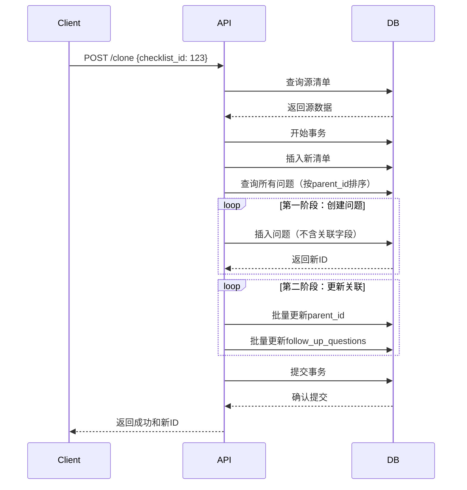

```mermaid
sequenceDiagram
    participant Client
    participant API
    participant DB
    
    Client->>API: POST /clone {checklist_id: 123}
    API->>DB: 查询源清单
    DB-->>API: 返回源数据
    API->>DB: 开始事务
    API->>DB: 插入新清单
    API->>DB: 查询所有问题（按parent_id排序）
    loop 第一阶段：创建问题
        API->>DB: 插入问题（不含关联字段）
        DB-->>API: 返回新ID
    end
    loop 第二阶段：更新关联
        API->>DB: 批量更新parent_id
        API->>DB: 批量更新follow_up_questions
    end
    API->>DB: 提交事务
    DB-->>API: 确认提交
    API-->>Client: 返回成功和新ID
```